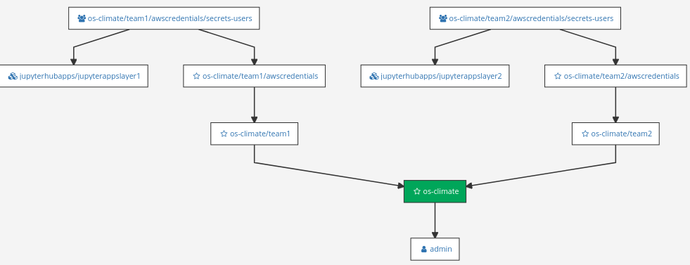

# Secret Management with CyberArk Conjur and Secretless Broker

## Pre-requisites
* Fedora (not tested in other environment)
* OpenShift 4.x 
* keyring

## Installation

### Customize `dap-service.config` with your environment information
```shell script
#Prepare an OpenShift cluster server and add the location of the config in `dap-service.config`
#e.g.
export KUBECONFIG=<~/.kube/config>   
#Add the OpenShift cluster domain
export CLUSTER_DOMAIN=<e.g.:cluster-436d.436d.sandbox1159.opentlc.com>

#Prepare one or two AWS users, and add the credentials to the `dap-service.config` 
export AWS_ACCESS_KEY=<acess_key1>
export AWS_SECRET_KEY=<secret_key1>
export AWS_ACCESS_KEY_2=<acess_key2>
export AWS_SECRET_KEY_2=<secret_key2>

#Run the setup script to install the Conjur Enterprise, POC applications and their Secretless Brokers
$./SETUP-POC.sh

#three projects are created as shown below
#project:`cyberlab` has the Conjur server and the Conjur cli tool installed
$oc get po -n cyberlab  
NAME                                READY   STATUS    RESTARTS   AGE
conjur-cli-5969fcdcf5-dg2b5         1/1     Running   0          5m41s
dap-service-node-7fc7967665-prx2g   1/1     Running   0          8m26s

#project `data-team1` has the POC Jupyter Notebook application for team1 installed
$oc get po -n data-team1
NAME                                    READY   STATUS    RESTARTS   AGE
os-climate-app-team1-7f587d9c9b-cnpcp   2/2     Running   0          8m49s

#project `data-team2` has the POC Jupyter Notebook application for team2 installed
$oc get po -n data-team2
NAME                                    READY   STATUS    RESTARTS   AGE
os-climate-app-team2-586888679c-vxtqw   2/2     Running   0          10m

#In each of the application pods, there are two containers. One is the Jupyter Notebook, and the other is the secretless broker sidecar
e.g.:
$oc get po -n data-team1 -o jsonpath="{.items[*].spec.containers[*].name}"  | tr -s '[[:space:]]' '\n'
os-climate-app-team1
secretless-broker
```
### Launch the Conjur UI with its route from the project `cyberlab`
username: `admin`; password is the one you input while the `./SETUP-POC.sh` was running. You can also retrieve it with `keyring get conjur adminpwd` after the setup is done


### Conjur UI, we can view all the policies which define the authn and authz for this POC


### Policies

The following policies are created in the Conjur for the Authentication and Authorization of OS-Climate applications:

[`Kubernetes Authenticator`](https://docs.conjur.org/Latest/en/Content/Integrations/kubernetes.htm?tocpath=Integrations%7COpenShift%252C%20Kubernetes%7C_____0) is used in the Conjur to authenticate with Secretless Brokers

<details>
    <summary>Click to see the Authenticator definition</summary>

```sh-session
---
# =================================================
# == Register the authentication service for a cluster
# =================================================
- !policy
id: conjur/authn-k8s/os-climate-poc
annotations:
    description: authn-k8s defs for the DAP cluster
body:

# vars for ocp/k8s api url & access creds
- !variable kubernetes/service-account-token
- !variable kubernetes/ca-cert
- !variable kubernetes/api-url

# vars for CA for this authenticator ID
- !variable ca/cert
- !variable ca/key

- !webservice
    annotations:
    description: authn service for cluster os-climate-poc

# Hosts that can authenticate become members of the
# `consumers` group.
- !group consumers

# Grant consumers group role authentication privileges
- !permit
    role: !group consumers
    privilege: [ read, authenticate ]
    resource: !webservice
```    
</details>


This policy defines the hosts where the OS-Climate applications are running:
<details>
    <summary>Click to see the host policy definition</summary>

```sh-session
- !policy
  id: jupyterhub
  body:
    # Hosts are the identity for authentication
    - &hosts
      - !host
        id: notebooks-team1
        annotations:
          authn-k8s/namespace: data-team1
          authn-k8s/service-account: data-team1
          authn-k8s/authentication-container-name: secretless-broker

      - !host
        id: notebooks-team2
        annotations:
          authn-k8s/namespace: data-team2
          authn-k8s/service-account: data-team2
          authn-k8s/authentication-container-name: secretless-broker

      - !host
        id: notebooks-team3
        annotations:
          authn-k8s/namespace: jupyterhub
          authn-k8s/service-account: data-team3
          authn-k8s/authentication-container-name: secretless-broker

    - !group

    - !grant
      role: !group
      members: *hosts

# the hosts can be authenticated with the authn-k8s webservice
- !grant
  role: !group conjur/authn-k8s/os-climate-poc/consumers
  member: !group jupyterhub
```
</details>

The following defines the layers. Each layer contains a list of hosts so that we can grant the credentials to a layer instead of each individual host:

<details>
    <summary>Click to see the layer definition</summary>

```sh-session
- !policy
  id: jupyterhubapps
  body:
    - !layer
      id: jupyterappslayer1

    - !grant
      role: !layer jupyterappslayer1
      members: #a list of hosts
        - !host /jupyterhub/notebooks-team1

    - !layer
      id: jupyterappslayer2

    - !grant
      role: !layer jupyterappslayer2
      members: #a list of hosts
        - !host /jupyterhub/notebooks-team2
        - !host /jupyterhub/notebooks-team3
```

</details>

The following defines the root policy for OS-Climate application and the immediate teams under it:

```sh-session
# the root policy or /os-climate
- !policy
  id: os-climate
```

```sh-session
# the policies/branches under the root /os-climate
- !policy
  id: team1

- !policy
  id: team2
```

The following defines the AWS credential variables where the actual secrets are stored. When this policy is loaded into Conjur, it is created as a sub-policy for each of the teams under OS-Climate application. This means that each team has their own credential.

```sh-session
#defines the secrets and load to each team's policy branch
#under os-climate/team[0-9]/...
- !policy
  id: awscredentials
  body:
  
    - &secrets
      - !variable aws-accesskey
      - !variable aws-secretkey
    
    - !group secrets-users

    - !permit
      resources: *secrets
      privileges: [read, execute]
      role: !group secrets-users
```

The following grants a credential to its corresponding layer/host where that team's application is running:

```sh-session
# root policy
# Grant secrets to a layer of host
- !grant
  role: !group os-climate/team1/awscredentials/secrets-users
  members: 
    - !layer jupyterhubapps/jupyterappslayer1/
    
- !grant
  role: !group os-climate/team2/awscredentials/secrets-users
  members: 
    - !layer jupyterhubapps/jupyterappslayer2/
```

The policies in Conjur are stored in a tree like structure:

The `admin` is a Conjur account.  Under it, we have defined the OS-Climate application, and it has two teams. Each team has its own credential, and the credential is granted to those hosts/layer where the application is running.



### Launch Jupyter Notebook application with the routes in the project `data-team1` or `data-team2`

To login, you can find the jupyter token in this Notebook application's container log in the corresponding pod in the project. e.g. container: `os-climate-app-team1`.  Put the token in the `password or token` box and click `Log in`


select `Secretless Demo with Conjur.ipynb` and run the Notebook


You can see the Notebook requests AWS login from the secretless broker and eventually it retrieves a list of buckets from the AWS account which is associted with this Notebook.
  
The ouput depends on the setting of the AWS account


## Clean up

```
$./_NUKE-POC.sh
```