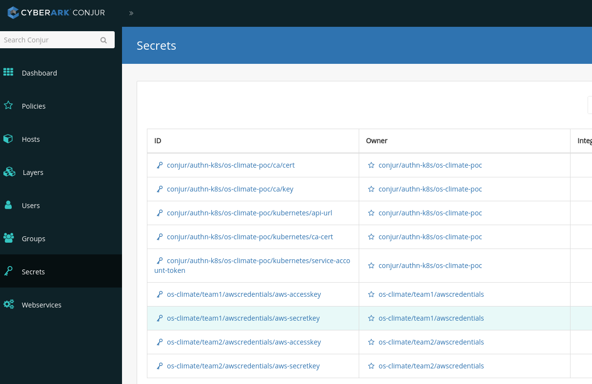
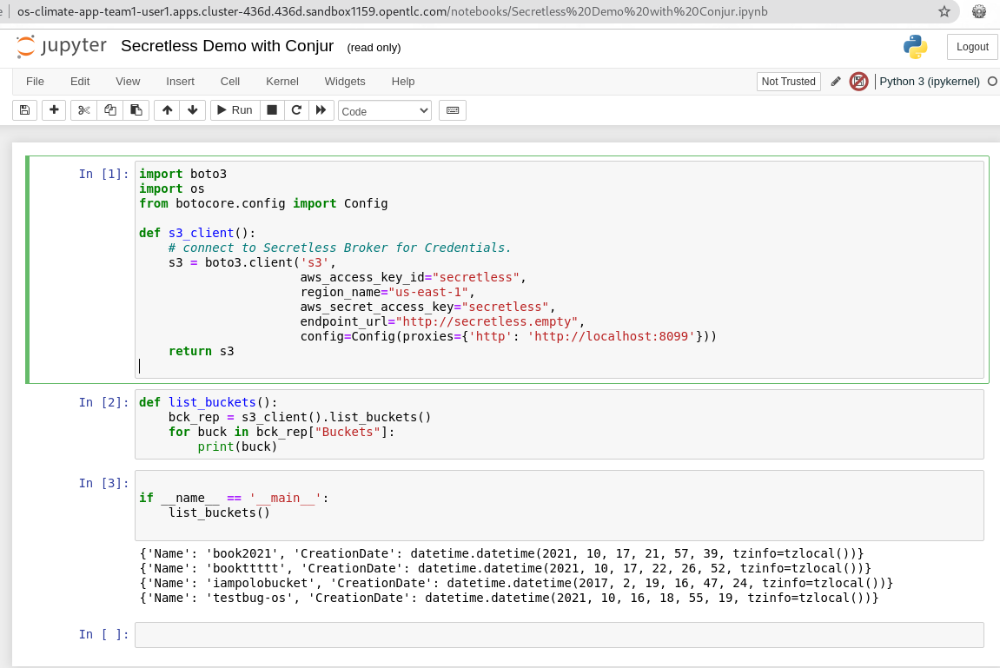

# Secret Management with CyberArk Conjur and Secretless Broker

## Prequisites
* Linux Fedora (not tested in other environment)
* OpenShift 4.x 
* keyring

## Installation

### Customize `dap-service.config` with your environment information
```shell script
#Prepare an OpenShift cluster server and add the location of the config in `dap-service.config`
#e.g.
export KUBECONFIG=<~/.kube/config>   
#Add the OpenShift cluster domain
export CLUSTER_DOMAIN=<e.g.:cluster-436d.436d.sandbox1159.opentlc.com>

#Prepare one or two AWS users, and add the credentials to the `dap-service.config` 
export AWS_ACCESS_KEY=<acess_key1>
export AWS_SECRET_KEY=<secret_key1>
export AWS_ACCESS_KEY_2=<acess_key2>
export AWS_SECRET_KEY_2=<secret_key2>

#Run the setup script to install the Conjur Enterprise, POC applications with Secretless Brokers
$./SETUP-POC.sh

#three projects are created as shown below
#project:`cyberlab` has the Conjur server and the Conjur cli tool installed
$oc get po -n cyberlab  
NAME                                READY   STATUS    RESTARTS   AGE
conjur-cli-5969fcdcf5-dg2b5         1/1     Running   0          5m41s
dap-service-node-7fc7967665-prx2g   1/1     Running   0          8m26s

#project `user1` has the POC Jupyter Notebook application for team1 installed
$oc get po -n user1   
NAME                                    READY   STATUS    RESTARTS   AGE
os-climate-app-team1-6cd566f8b6-5x5jf   2/2     Running   0          6m22s

#project `user2` has the POC Jupyter Notebook application for team2 installed
$oc get po -n user2
NAME                                    READY   STATUS    RESTARTS   AGE
os-climate-app-team2-84cbb66994-cnfjf   2/2     Running   0          6m23s

#In each of the application pods, there are two containers. One is the Jupyter Notebook itself, and the other is the secretless broker sidecar
e.g.:
$oc get po -n user1 -o jsonpath="{.items[*].spec.containers[*].name}"  | tr -s '[[:space:]]' '\n'
os-climate-app-team1
secretless-broker
```
### Launch the Conjur UI with its route from the project `cyberlab`
username: `admin`; password is the one you input while the `./SETUP-POC.sh` was running. You can also retrieve it with `keyring get conjur adminpwd` after the setup is done


### Conjur UI, we can view all the policies which define the authn and authz for this POC



### Launch Jupyter Notebook application with the routes in the project `user1` or `user2`

To login, you can find the jupyter token in this Notebook application's container log in the corresponding pod in the project. e.g. container: `os-climate-app-team1`.  Put the token in the `password or token` box and click `Log in`


select `Secretless Demo with Conjur.ipynb` and run the Notebook


You can see the Notebook requests AWS login from the secretless broker and eventually it retrieves a list of buckets from the AWS account which is associted with this Notebook.
  
The ouput depends on the setting of the AWS account


## Clean up

```
$./_NUKE-POC.sh
```